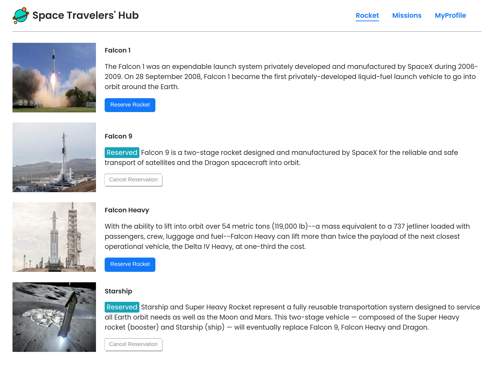
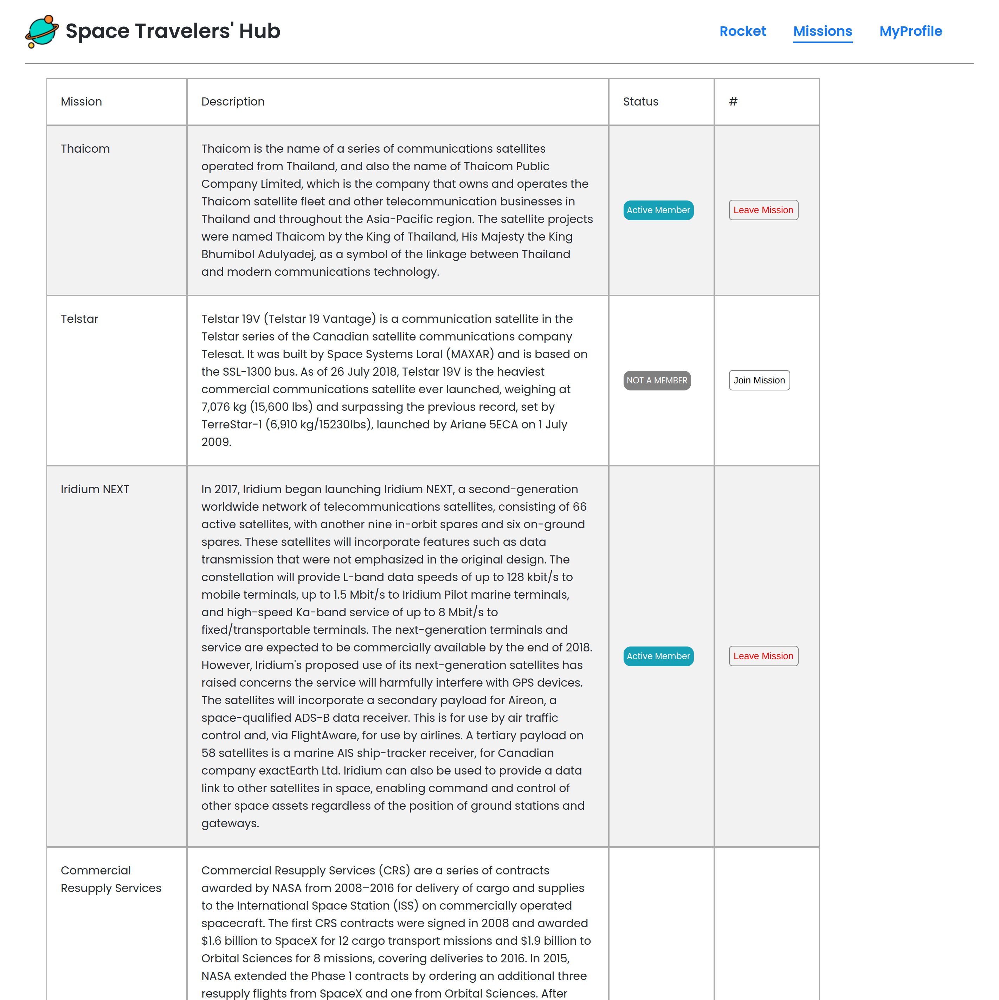
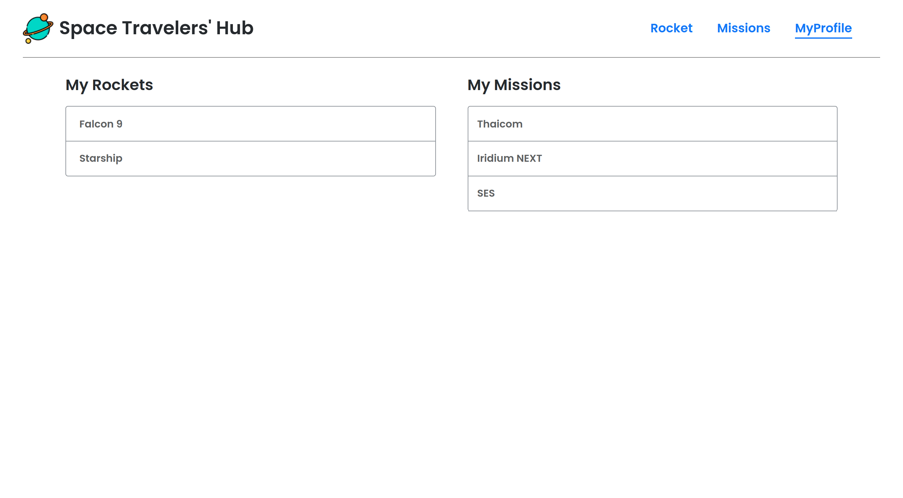

# Space-X

This project was bootstrapped with [Create React App](https://github.com/facebook/create-react-app).

> |     | Rockets page                           | Missions page                      |     |
> | --- | ----------------------------------- | ------------------------------------ | --- |
> |     |  |  |
> |     | MyProfile page                         |
> |     |  |

## Description

> "Space-X" is a website that allows users to book rockets and join selected space missions by using data from the SpaceX API.

## Built With

This project is built with:

- 
- 
- 
- 
- 

## Live Demo

Click [here]() to see the live demo

## Getting Started

To get the content of this project locally you need to run these commands in your terminal.
Before starting the steps below, be sure you have [Git](https://www.linode.com/docs/guides/how-to-install-git-on-linux-mac-and-windows/) and [Node.js](https://nodejs.dev/learn/how-to-install-nodejs) installed in your computer.

1. `git clone https://github.com/Banstein/space-x.git`
2. `cd space-x`
3. `npm install` 
  This will download all the dependancies of the project.
4. `npm start` 
  The page will open at http://localhost:3000 in your browser.

It correctly bundles React in production mode and optimizes the build for the best performance. 

## Test

For tracking linter errors locally you need to follow these steps:

- After cloning the project make sure you have run this command

  > `npm install` command

- For tracking the linter errors in CSS file run:

  > `npx stylelint "\*_/_.{css,scss}"`

- For tracking the linter errors in JavaScript file run:

  > `npx eslint .`

- And For running some unit tests:

  > `npm test`

## Authors

👤 **Islam Bahnas**

- GitHub: [@Banstein](https://github.com/Banstein)
- Twitter: [@islam_bahnas](https://twitter.com/islam_bahnas)
- LinkedIn: [islam-bahnas](www.linkedin.com/in/islam-bahnas)

👤 **Cynthia Inga Candy**

- GitHub: [@cynthiainga](https://github.com/cynthiainga)
- Twitter: [@CynthiaInga_C](https://twitter.com/CynthiaInga_C)
- LinkedIn: [Cynthia Inga](https://www.linkedin.com/in/cynthia-inga/)

## :handshake: Contributing

Feel free to check the [issues page](https://github.com/Banstein/space-x/issues)

## Show your support

Give a :star: if you like this project!

## Acknowledgments

- Thanks to everyone who will get time to check this code especially to code reviewers.

## 📝 License

This project is [MIT](./MIT.md) licensed.
